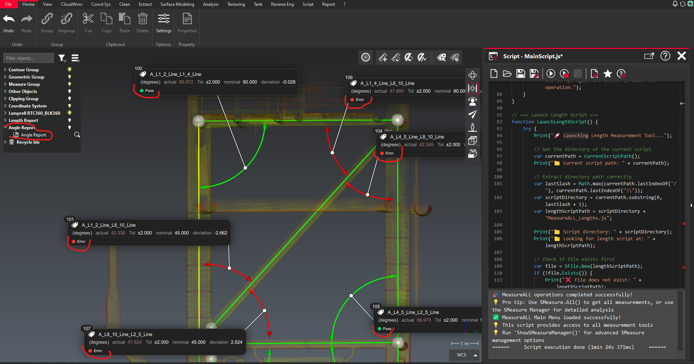
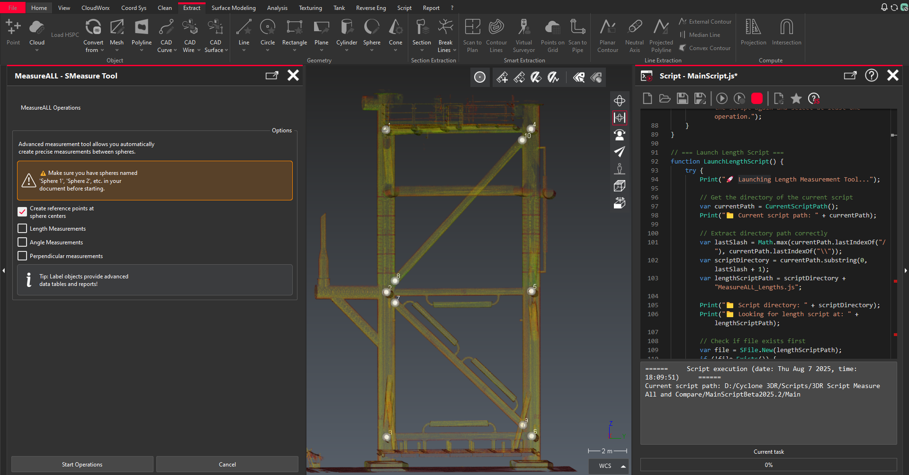
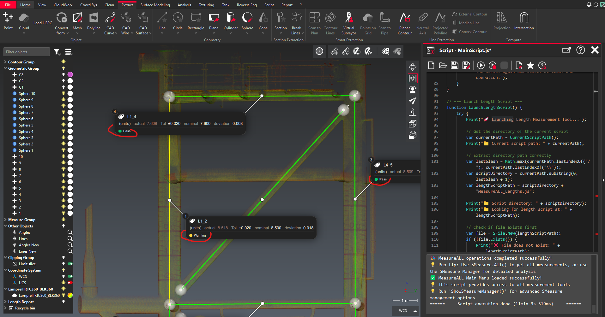
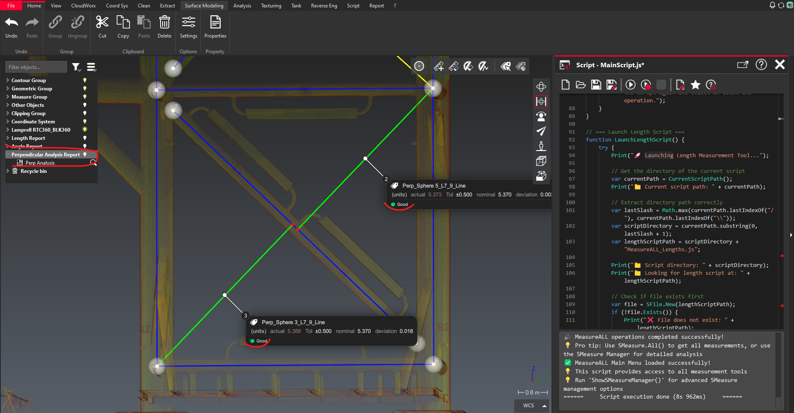

# Cyclone-3DR-Automated-Measurements
With this script, you can extract lengths and angles, compare them with nominal values, and generate detailed reports within Leica Cyclone 3DR software. It's particularly useful in pre-fabrication applications where you need to extract measurements according to predefined standards.



# MeasureALL Suite - Professional Measurement Tools for Cyclone 3DR

**Comprehensive measurement automation suite for industrial metrology and quality control** - Creates precise measurement objects with tolerance analysis and professional reporting capabilities.

## Overview

MeasureALL is a professional measurement toolkit designed for Cyclone 3DR that automates complex dimensional analysis workflows. The suite provides systematic measurement capabilities for length, angle, and perpendicular distance analysis with integrated tolerance control and comprehensive reporting.

## Key Features

- **Modular Architecture**: Four integrated tools for comprehensive measurement workflows
- **Smart Sphere Renaming**: Automatic sphere naming consistency for reliable measurements
- **Multiple Selection Scenarios**: Default, Sequential, and Custom measurement patterns
- **SMeasure Integration**: Professional measurement objects with tolerance analysis
- **Visual Feedback**: Color-coded results with real-time tolerance status
- **Comprehensive Reporting**: Automated SReport generation with statistical analysis
- **Quality Control**: Built-in tolerance management and deviation tracking

## System Requirements

- **Cyclone 3DR 2025.2** or newer
- **Sphere objects** named following "Sphere N" convention (auto-renaming available)
- **Line objects** for angle and perpendicular measurements

## Suite Components

### 1. MainScript.js - Central Control Hub
**Primary interface for accessing all measurement tools**



Features:
- Unified control panel for all measurement operations
- Automatic sphere center point generation
- Smart sphere renaming system
- Integration with specialized measurement modules
- Advanced SMeasure management and analysis

Usage:
- Run from Cyclone 3DR Scripts menu
- Select desired measurement operations
- Automatic sphere validation and renaming
- Creates white reference points at sphere centers

### 2. MeasureALL_Lengths.js - Distance Measurements
**Precise length measurements between sphere centers with SMeasure objects**



#### Selection Scenarios:
| Scenario | Description | Use Case |
|----------|-------------|----------|
| **Default Set** | Predefined measurement pairs | Standard quality control |
| **Sequential Pairs** | Consecutive sphere connections | Linear assemblies |
| **Custom Selection** | Manual pair selection | Complex geometries |

Features:
- Automatic distance calculations between sphere centers
- Visual line indicators with color-coded tolerance status
- SMeasure objects with actual/nominal/deviation data
- Tolerance analysis with configurable thresholds
- Professional measurement reports

### 3. MeasureALL_Angles.js - Angular Measurements
**Angle measurements between existing measurement lines with visual arc creation**


#### Selection Scenarios:
| Scenario | Description | Use Case |
|----------|-------------|----------|
| **Default Set** | Predefined angle combinations | Standard assemblies |
| **Sequential Pairs** | Adjacent line connections | Systematic analysis |
| **Custom Selection** | Manual angle selection | Complex angular relationships |

Features:
- Automatic angle calculations between measurement lines
- Visual arc creation at line intersections
- Advanced arc positioning with geometric precision
- SMeasure objects with tolerance-based classification
- Comprehensive angle analysis reports

### 4. MeasureALL_Perpendic.js - Perpendicular Analysis
**Perpendicular distance measurements from sphere centers to lines**



#### Selection Scenarios:
| Scenario | Description | Use Case |
|----------|-------------|----------|
| **Default Set** | First 3 spheres to first 2 lines | Standard validation |
| **All Spheres to First Line** | Reference-based analysis | Systematic alignment check |
| **Custom Selection** | Manual sphere-line pairs | Complex geometries |

Features:
- Precise perpendicular distance calculations
- Visual perpendicular lines with foot point markers
- Color-coded tolerance status indicators
- SMeasure objects with comprehensive analysis data
- Statistical reporting with quality metrics

## Installation & Setup

### 1. File Organization
```
MeasureALL/
├── MainScript.js                    # Main control interface
├── MeasureALL_Lengths.js           # Length measurements
├── MeasureALL_Angles.js            # Angle measurements
└── Measure Perpendic_Beta2025.2.js # Perpendicular analysis
```

### 2. Cyclone 3DR Integration
1. Place all script files in the same directory
2. Run `MainScript.js` from Cyclone 3DR Scripts menu
3. Follow dialog prompts for operation selection
4. Scripts automatically locate and execute related modules

## Measurement Workflows

### Basic Workflow
1. **Preparation**: Import point cloud into Cyclone 3DR
2. **Sphere Setup**: Create/import spheres (auto-renaming available)
3. **Main Interface**: Run MainScript.js for unified access
4. **Operation Selection**: Choose measurement types and modes
5. **Results**: Review created objects and generated reports

### Advanced Analysis
1. **Tolerance Definition**: Set nominal values and tolerance bands
2. **Pattern Selection**: Choose appropriate measurement scenarios
3. **Quality Analysis**: Review color-coded results and statistics
4. **Report Generation**: Export comprehensive measurement reports

## Output Classifications

| Status | Description | Visual Indicator |
|--------|-------------|------------------|
| **Good** | Within tolerance | Green color |
| **Warning** | Near tolerance limit | Yellow color |
| **Error** | Outside tolerance | Red color |
| **Measured** | Simple mode (no tolerance) | Blue color |

## Label Object Structure

Each measurement creates professional Label objects containing:
- **Actual Values**: Measured dimensions
- **Nominal Values**: Expected/design values (full analysis mode)
- **Deviations**: Calculated differences
- **Tolerance Status**: Pass/Warning/Error classification
- **Measurement Metadata**: Point IDs, coordinates, parameters

## Configuration Parameters

### Length Measurements
- **Good Threshold**: Maximum acceptable deviation (default: 0.01)
- **Warning Threshold**: Maximum deviation before error (default: 0.02)
- **Measurement Pairs**: Configurable sphere combinations

### Angle Measurements
- **Good Threshold**: Angular deviation in degrees (default: 1.0°)
- **Warning Threshold**: Maximum angular deviation (default: 2.0°)
- **Arc Visualization**: Automatic geometric arc creation

### Perpendicular Measurements
- **Good Tolerance**: Distance deviation (default: 0.01)
- **Warning Tolerance**: Maximum distance deviation (default: 0.02)
- **Search Parameters**: Configurable measurement precision

## Professional Features

### Automatic Sphere Management
- **Smart Renaming**: Converts inconsistent sphere names to "Sphere N" format
- **Validation Checks**: Ensures naming consistency before measurements
- **Reference Points**: Creates visual markers at sphere centers

### Quality Control Integration
- **Tolerance Analysis**: Configurable pass/fail criteria
- **Statistical Reporting**: Comprehensive measurement statistics
- **Visual Feedback**: Color-coded results for immediate assessment
- **Professional Documentation**: SMeasure objects for audit trails

### Reporting Capabilities
- **SReport Generation**: Automated professional reports
- **Measurement Summaries**: Statistical analysis and counts
- **Export Options**: Integration with Cyclone 3DR report system
- **Audit Trails**: Complete measurement documentation

## Troubleshooting

### Common Issues

**"No spheres found"**
- Check sphere objects exist in document
- Verify sphere naming convention
- Use auto-rename feature in main script

**"Insufficient lines for angles"**
- Ensure length measurements completed first
- Check line objects exist and are named correctly
- Minimum 2 lines required for angle measurements

**"Script file not found"**
- Verify all script files in same directory
- Check file names match exactly
- Use main script to launch other modules

### Best Practices

1. **Consistent Naming**: Use sphere auto-rename feature for reliability
2. **Systematic Approach**: Start with main script for proper workflow
3. **Tolerance Setting**: Configure appropriate thresholds for application
4. **Result Validation**: Review SMeasure objects and reports
5. **Documentation**: Save measurement sessions for audit purposes

## Technical Specifications

### Performance Characteristics
- **Processing Speed**: Optimized for large measurement sets
- **Memory Usage**: Efficient object management
- **Scalability**: Handles complex measurement scenarios
- **Reliability**: Robust error handling and validation

## License & Attribution

- **Development**: Aleksand Solopov
- **Platform**: Leica Cyclone 3DR
- **Application**: Industrial measurement and quality control
- **Compatibility**: Cyclone 3DR 2025.2+

---

**Version**: 2025.2   
**Compatibility**: Cyclone 3DR 2025.2+  
**Category**: Industrial Metrology & Quality Control
